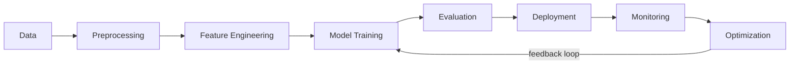

<div align="center">

<!-- HERO -->
<h1>Abhishek Prasad</h1>
<p>AI Engineer &nbsp;|&nbsp; ML Enthusiast &nbsp;|&nbsp; Data Scientist</p>

<!-- TYPING -->
<h2>
  <code>LLMs</code> <span style="color:#58a6ff">|</span> <code>RAG</code> <span style="color:#58a6ff">|</span> <code>Deep Learning</code> 🤖
</h2>

<!-- BADGES -->
<p>
  
  &nbsp;
  
  &nbsp;
  
</p>

</div>

---

## 🧠 About Me - Neural Network Profile

```python
import tensorflow as tf
import numpy as np
from datetime import datetime

class AIEngineer:
    def __init__(self):
        # Personal Metadata
        self.name             = "Abhishek Prasad"
        self.username         = "courageous0102"
        self.role             = "AI/ML Engineer & Data Scientist"
        self.status           = "B.Tech CSE - 3rd Year"
        self.experience_years = 2
        self.email            = "abhip9835@gmail.com"

        # Neural Network Architecture
        self.skills = {
            'programming'    : ['Python', 'Java', 'C', 'C++'],
            'ml_frameworks'  : ['TensorFlow', 'PyTorch', 'Keras', 'Scikit-learn'],
            'ai_domains'     : ['Deep Learning', 'NLP', 'Computer Vision', 'LLMs'],
            'data_science'   : ['Pandas', 'NumPy', 'Matplotlib', 'Plotly'],
            'cloud'          : ['AWS', 'GCP'],
            'specialization' : ['RAG', 'Transformers', 'Model Optimization']
        }

        # Current Training Loop
        self.learning_pipeline = [
            "🎯 Advanced Machine Learning Algorithms",
            "🚀 Deep Neural Networks & Architectures",
            "💬 Large Language Models (LLMs)",
            "🔗 Retrieval-Augmented Generation (RAG)",
            "☁️ Cloud ML Deployment (AWS SageMaker)",
            "🚀 MLOps & Model Production",
        ]

        # Model Performance Metrics
        self.achievements = {
            'accuracy'      : 'High',
            'passion'       : 'Maximum',
            'collaboration' : 'Always Open',
            'innovation'    : 'Continuous'
        }

    def forward_pass(self):
        """Processing current projects and learning"""
        projects = [
            "Building production-ready ML models",
            "Implementing LLMs in real-world applications",
            "Creating RAG systems for intelligent retrieval",
            "Developing AI-powered solutions"
        ]
        return projects

    def backward_propagation(self):
        """Learning from feedback and improving"""
        return "Always optimizing through collaboration and feedback!"

    def predict_future(self):
        """My vision for the future"""
        return "Creating AI systems that make a real impact 🚀"

    def connect(self):
        """Let's collaborate!"""
        return f"🌐 Reach me at: {self.email}"

# Initialize the model
abhishek = AIEngineer()
print(abhishek.predict_future())
print(abhishek.connect())
```

<p align="center">💡 <em>"Turning data into intelligence, one model at a time"</em></p>

---

## 🌐 Connect & Collaborate

<p align="center">
  <a href="#">
    
  </a>
  <a href="#">
    
  </a>
  <a href="mailto:abhip9835@gmail.com">
    
  </a>
  <a href="#">
    
  </a>
</p>

---

## 🎯 Current Learning Pipeline



<!-- EXPERTISE GRID -->
<table>
  <tr>
    <td align="center" width="25%">
      <h3>🧠 Machine<br/>Learning</h3>
      <ul align="left">
        <li>Supervised & Unsupervised</li>
        <li>Model Optimization</li>
        <li>Feature Engineering</li>
      </ul>
    </td>
    <td align="center" width="25%">
      <h3>🕸️ Deep Learning</h3>
      <ul align="left">
        <li>Neural Networks</li>
        <li>CNNs & RNNs</li>
        <li>Transfer Learning</li>
      </ul>
    </td>
    <td align="center" width="25%">
      <h3>🤖 LLMs & NLP</h3>
      <ul align="left">
        <li>GPT Models</li>
        <li>RAG Systems</li>
        <li>Fine-tuning</li>
      </ul>
    </td>
    <td align="center" width="25%">
      <h3>☁️ Cloud & MLOps</h3>
      <ul align="left">
        <li>AWS SageMaker</li>
        <li>Model Deployment</li>
        <li>CI/CD Pipelines</li>
      </ul>
    </td>
  </tr>
</table>

---

## 💻 Tech Stack - AI/ML Arsenal

### 🤖 AI/ML & Data Science
<p>
  
  
  
  
  
  
  
  
  
  
  
</p>

### 👨‍💻 Programming Languages
<p>
  
  
  
  
  
  
  
</p>

### ☁️ Cloud & Deployment
<p>
  
  
  
  
  
  
</p>

### 🛠️ Tools & Platforms
<p>
  
  
  
  
  
  
</p>

### 🗄️ Databases
<p>
  
  
  
  
</p>

---

## 📊 GitHub Analytics - Model Performance Metrics

<p align="center">
  
  
</p>

<p align="center">
  
</p>

<p align="center">
  
</p>

<p align="center">
  
</p>

---

## 🏆 GitHub Trophies & Achievements

<p align="center">
  
</p>

---

## 💭 AI-Generated Dev Quote

<div align="center">
  <p><em>Every time you improve process, work becomes harder.</em></p>
  <p>— Daniel T. Barry</p>
</div>

---

## 🔥 Current Projects & Focus Areas

```python
current_projects = {
    "🤖 Machine Learning Models": {
        "status": "In Production",
        "description": "Building scalable ML models for real-world problems",
        "tech_stack": ["TensorFlow", "PyTorch", "Scikit-learn"]
    },
    "💬 LLM Applications": {
        "status": "Active Development",
        "description": "Implementing Large Language Models in applications",
        "tech_stack": ["Transformers", "Hugging Face", "OpenAI API"]
    },
    "🔗 RAG Systems": {
        "status": "Research & Development",
        "description": "Creating intelligent retrieval systems",
        "tech_stack": ["LangChain", "Vector DBs", "Embeddings"]
    },
    "☁️ AI on Cloud": {
        "status": "Learning & Deploying",
        "description": "Deploying ML models on cloud platforms",
        "tech_stack": ["AWS", "SageMaker", "Lambda"]
    }
}

for project, details in current_projects.items():
    print(f"{project}: {details['status']}")
```

---

## 🗺️ Learning Roadmap 2024-2025

| Quarter | Focus Area | Technologies | Status |
|---|---|---|---|
| Q1 2024 | **Deep Learning Fundamentals** | TensorFlow, PyTorch, Keras | ✅ Completed |
| Q2 2024 | **Natural Language Processing** | NLTK, spaCy, Transformers | 🔄 In Progress |
| Q3 2024 | **Large Language Models** | GPT, BERT, LLaMA, RAG | 🔄 In Progress |
| Q4 2024 | **Computer Vision** | OpenCV, YOLO, CNN | 📅 Planned |
| Q1 2025 | **MLOps & Production** | Docker, Kubernetes, MLflow | 📅 Planned |
| Q2 2025 | **Advanced AI Systems** | Multi-modal AI, AGI Research | 🎯 Future Goal |

---

## ⭐ Featured AI/ML Projects

### 🤖 Intelligent RAG System
A production-ready Retrieval-Augmented Generation system using LangChain, vector databases, and OpenAI APIs for intelligent document Q&A.

<p>
  <code>Python</code> <code>LangChain</code> <code>OpenAI</code> <code>FAISS</code> <code>FastAPI</code>
</p>

### 🧠 Deep Learning Image Classifier
CNN-based image classification model achieving 95%+ accuracy on custom datasets with transfer learning from ResNet & EfficientNet.

<p>
  <code>PyTorch</code> <code>CNN</code> <code>Transfer Learning</code> <code>OpenCV</code>
</p>

---

## 🎯 Skills & Expertise Radar

```text
Machine Learning    ████████████████████████████████████░░░░ 85%
Deep Learning       ███████████████████████████████████░░░░░ 80%
LLMs/RAG            █████████████████████████████████░░░░░░░ 75%
Python              ██████████████████████████████████████░░░░ 90%
Data Science        ████████████████████████████████████░░░░ 85%
Cloud (AWS/GCP)     ██████████████████████████░░░░░░░░░░░░░░ 65%
Computer Vision     ████████████████████████░░░░░░░░░░░░░░░░░░ 60%
NLP                 █████████████████████████████████░░░░░░░ 75%
```

---

## 📚 AI/ML Resources I Recommend

<details>
  <summary>▶ 💻 Click to expand my favorite learning resources</summary>

  - 📖 [Deep Learning by Goodfellow, Bengio & Courville](#) — The bible of DL
  - 🎓 [fast.ai Practical Deep Learning](#) — Top-down hands-on approach
  - 🤗 [Hugging Face Course](#) — Best NLP & Transformers resource
  - ☁️ [AWS ML Specialty Certification](#) — Cloud ML deployment
  - 📊 [Kaggle Learn](#) — Practical ML competitions & notebooks
  - 🔗 [LangChain Documentation](#) — LLM application framework
  - 📹 [Andrej Karpathy's YouTube](#) — Neural networks from scratch

</details>

---

## 🤝 Let's Collaborate!

<div align="center">

<p><strong>I'm always interested in:</strong></p>
<p>🔬 Research Projects &nbsp;|&nbsp; 🚀 Startup Ideas &nbsp;|&nbsp; 💡 Open Source &nbsp;|&nbsp; 🧑‍🏫 Learning Together</p>
<p><strong>Want to build something amazing with AI?</strong></p>

<p>
  <a href="#">
    
  </a>
</p>

</div>

---

## 🎨 Fun Facts About Me

```python
fun_facts = {
    "🖥️ First Program": "Hello World in Python (fell in love instantly!)",
    "☕ Fuel": "Coffee + Classical Music = Peak Productivity",
    "🎯 Motto": "Make AI accessible, ethical, and impactful",
    "🌙 Night Owl": "Best code written between 10 PM - 2 AM",
    "🎮 Debugging Style": "Print statements everywhere (then use debugger)",
    "📊 Favorite Dataset": "MNIST (the hello world of ML)",
    "🤖 Dream Project": "Contributing to AGI development"
}

for key, value in fun_facts.items():
    print(f"{key}: {value}")
```

> 💡 *"In the age of AI, the only limit is imagination"*

---

<div align="center">

<h3>Thanks for visiting! Let's build the future with AI 🚀</h3>

<p>
  
</p>

<p><em>Last Updated: 2024 | Made with ❤️ and Python</em></p>

</div>
